# NYC Taxi Hybrid Data Pipeline

An end-to-end data platform on **Google Cloud Platform** that processes NYC Taxi data through two complementary pipelines — a **batch** pipeline for historical data and a **streaming** pipeline for real-time events. Both land in the same BigQuery warehouse, so you can query historical and live operational data side by side.

## How it works

**Batch pipeline** loads historical Taxi trips (April–May 2026) from Google Cloud Storage, orchestrated by Apache Airflow and transformed with dbt into BigQuery.

**Streaming pipeline** simulates live taxi trip events (June–July 2026), publishing them to Google Pub/Sub and processing them through an Apache Beam consumer into curated and quarantine tables in BigQuery.

```
Historical CSVs → GCS → Airflow → dbt → BigQuery
Simulated events → Pub/Sub → Apache Beam → BigQuery (curated / quarantine)
```

## Architecture

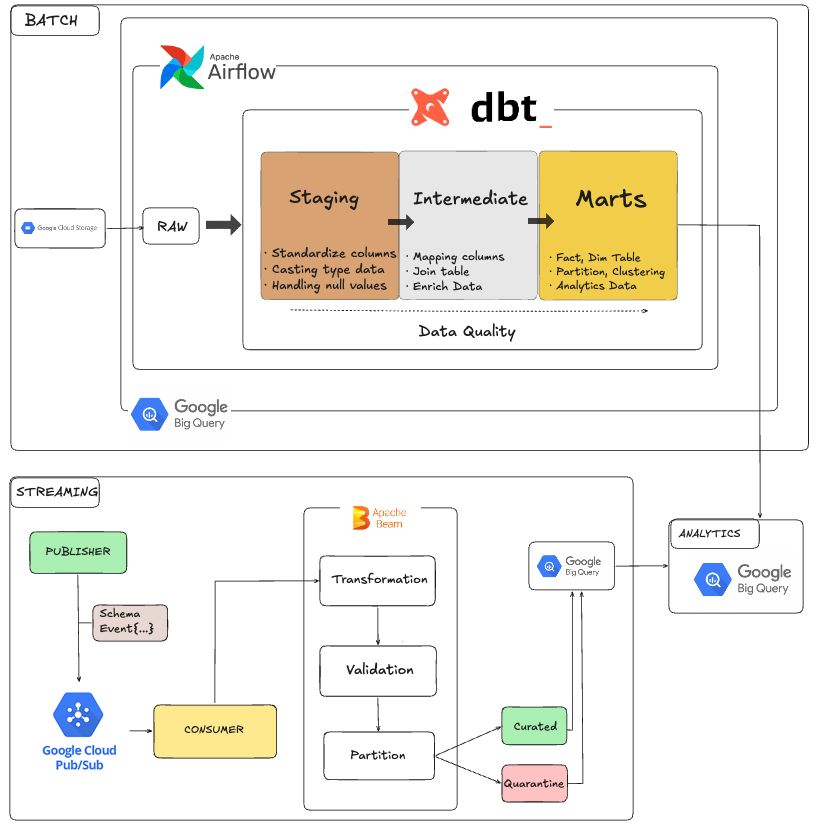

## Tech stack

| Layer | Technology |
|---|---|
| Language | Python |
| Orchestration | Apache Airflow |
| Streaming | Apache Beam |
| Message broker | Google Pub/Sub |
| Data lake | Google Cloud Storage |
| Warehouse | Google BigQuery |
| Transformation | dbt |
| Documentation | dbt Docs |
| Containers | Docker Compose |

## Project structure

```
.
├── airflow/       # DAGs and Airflow config
├── constants/      
├── data/          # Raw, Processed, Archived sample data
├── dbt_gcp/       # dbt models and docs
├── docs/
├── streaming/     # Pub/Sub producer + Beam consumer
├── .env.example
├── docker-compose.yml
├── Dockerfile
└── requirements.txt
```

## Assumptions

- Historical data (April–May 2026) is uploaded to Google Cloud Storage before the batch pipeline is executed.
- Streaming events represent new taxi trips for June–July 2026 periods.
- Google Cloud resources (GCS, Pub/Sub, BigQuery) already enabled and exist.
- Application Default Credentials (ADC) or a Service Account are configured correctly.
- The batch pipeline may be rerun safely using the same parameters.

## Getting started

### 1. Clone and set up your environment

```bash
git clone https://github.com/gatotbima1104/nyc-taxi-data-platform
cd gcp-batch-streaming-pipeline

python -m venv .venv
source .venv/bin/activate      # macOS/Linux
.venv\Scripts\activate         # Windows

pip install -r requirements.txt
cp .env.example .env           # then fill in the required variables
```

### 2. Authenticate with Google Cloud

This project uses Application Default Credentials (ADC):

```bash
gcloud auth login
gcloud config set project <PROJECT_ID>
gcloud auth application-default login

# verify it worked
gcloud auth application-default print-access-token
```

Docker Compose automatically mounts `~/.config/gcloud` into the containers, so once you're authenticated locally, the containers can use those credentials too.

### 3. Start the services

```bash
docker compose up -d airflow-init
docker compose up -d
```

## Google Cloud Storage

| Bucket | Purpose |
|---------|----------|
| `raw_bucket` | Stores historical NYC Taxi datasets before processing |
| `processed_bucket` | Stores fact table datasets by the batch pipeline |

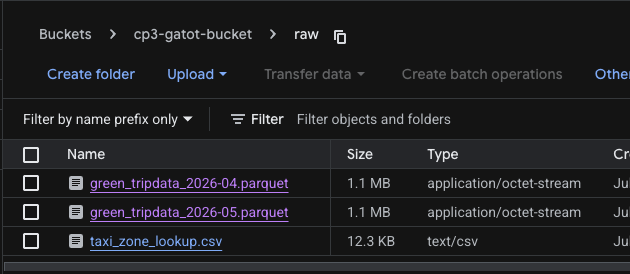

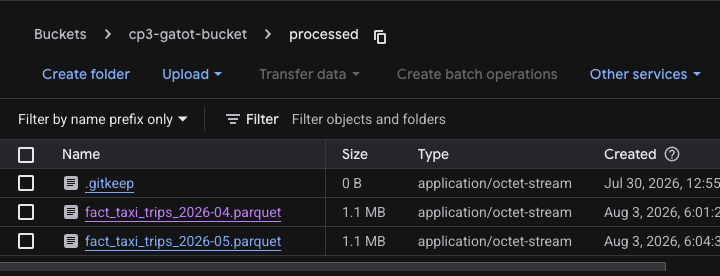

## Running the batch pipeline

1. **Upload the historical NYC Taxi datasets** (April and May 2026) or more to your configured **Google Cloud Storage (GCS) bucket**. Ensure the files are stored in the expected location so the pipeline can ingest them.
2. Open Airflow at [`airflow.local`](http://airflow.local) or [`localhost:8080`](http://localhost:8080).
3. Go to **Admin → Connections → Add Connection** and configure:

   | Field | Value |
   |---|---|
   | Connection ID | `google_cloud_default` |
   | Connection Type | Google Cloud |

   Paste your service account JSON into the **Extra** field:
   ```json
   { "keyfile_dict": { ... } }
   ```
4. Trigger the `batch_pipeline` DAG, passing `trip_year` and `trip_month` as parameters.
5. Once it finishes, browse the results in dbt Docs at [`dbt-docs.local`](http://dbt-docs.local) or [`localhost:8081`](http://localhost:8081) — model lineage, SQL, column docs, and dependencies are all there.

`Dag: Batch Pipeline`
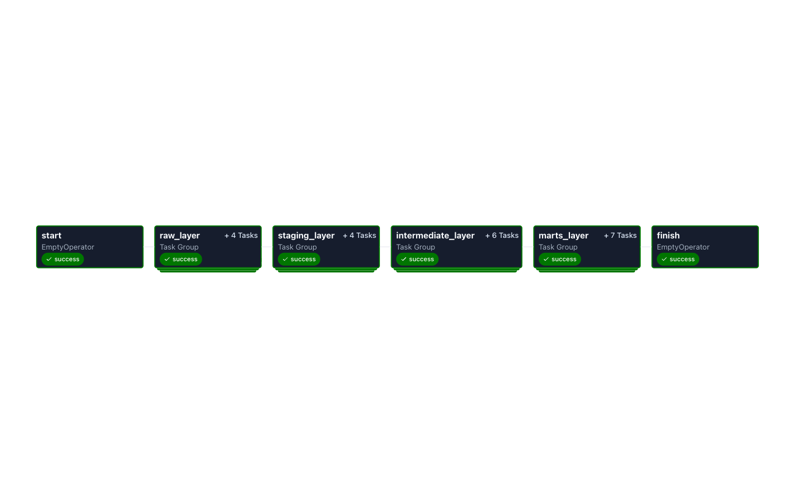

`Dag: Raw layer`
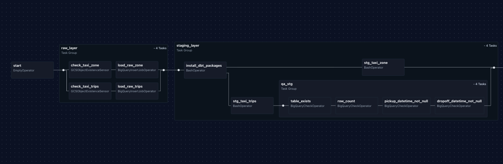

`Dag: Int layer`
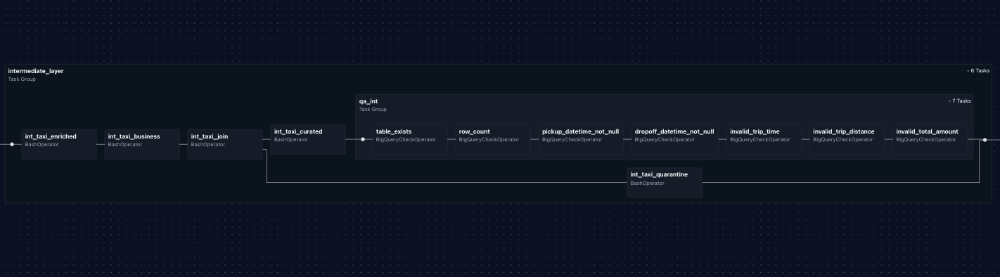

`Dag: Marts layer`
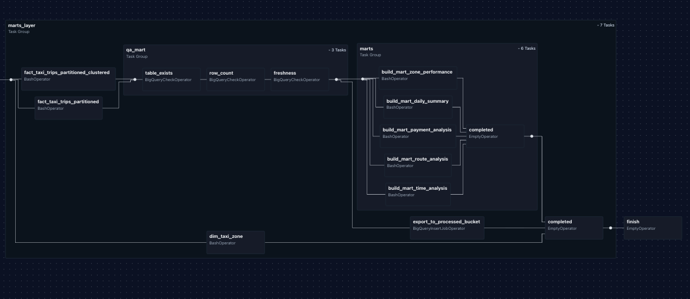

`DAG: DBT Docs`
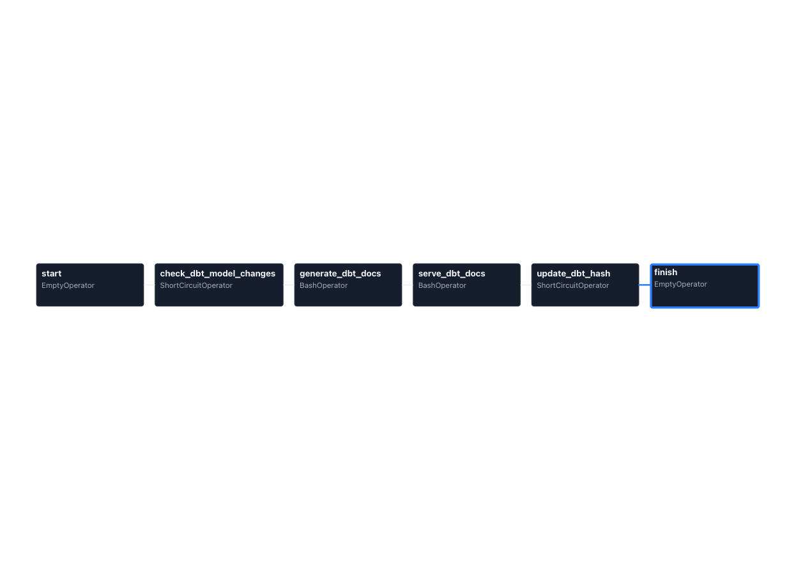

`DAG: Log`
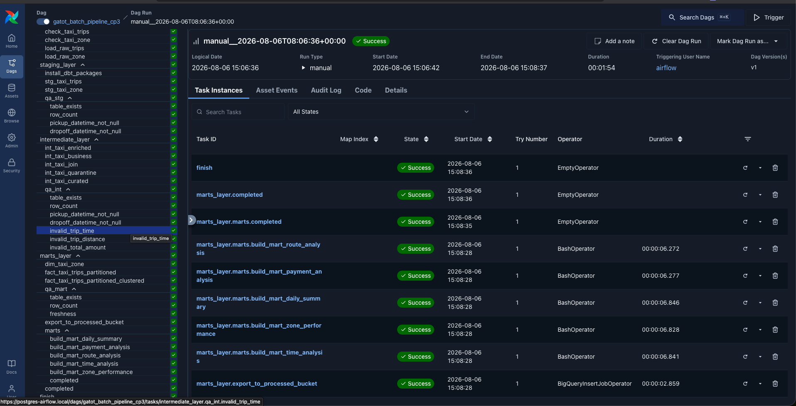

## DBT Documentation
 
Once the batch pipeline finishes, open dbt Docs at [`dbt-docs.local`](http://dbt-docs.local) or [`localhost:8081`](http://localhost:8081) to explore:
 
- Model lineage
- SQL models
- Column documentation
- Model dependencies

#### DBT docs
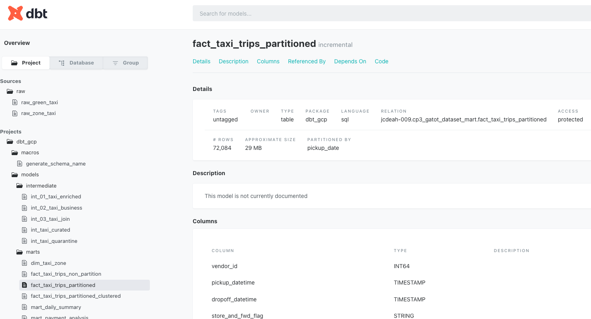

#### DBT Lineages
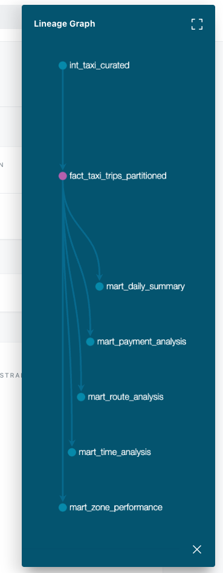

## Running the streaming pipeline

Open two terminals.

**Terminal 1 — publisher**, with these settings applied:
```
max_event = 500
EVENTS_PER_INTERVAL = 1
PUBLISH_INTERVAL_SECONDS = 1
INVALID_EVENT_RATE = 0.05
```
```bash
python -m streaming.producer.publisher
```

**Terminal 2 — consumer:**
```bash
python -m streaming.consumer.pipeline --runner=DirectRunner
```

#### Both are running output
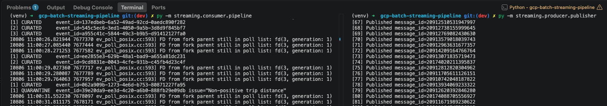
---

## BigQuery data model
 
Both pipelines land in BigQuery through the same layered structure, so batch and streaming data are easy to compare and join.
 
**Batch (dbt layers)**
 
| Layer | Purpose |
|---|---|
| `stg_` | 1:1 with source data, light cleanup (types, renames) |
| `int_` | Joins/aggregations, business logic building blocks |
| `marts_` | Final, analytics-ready tables used for reporting |
 
**Streaming tables**
 
| Table | Purpose |
|---|---|
| `streaming_curated` | Events that passed validation |
| `streaming_quarantine` | Events that failed validation, kept for review |
 

### Table Models
---
#### `stg_views`
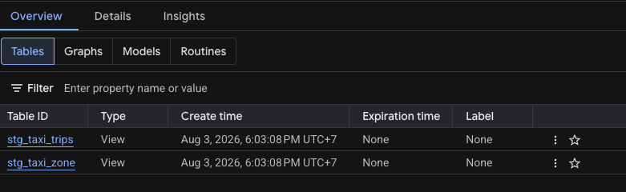
#### `int_tables`
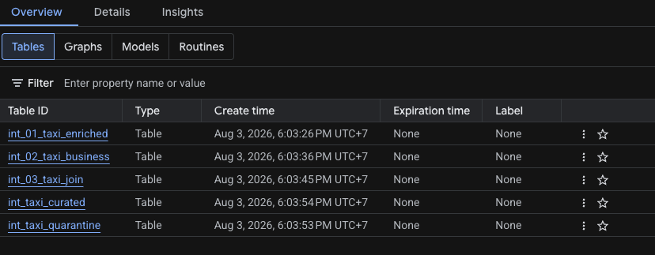
#### `marts_tables`
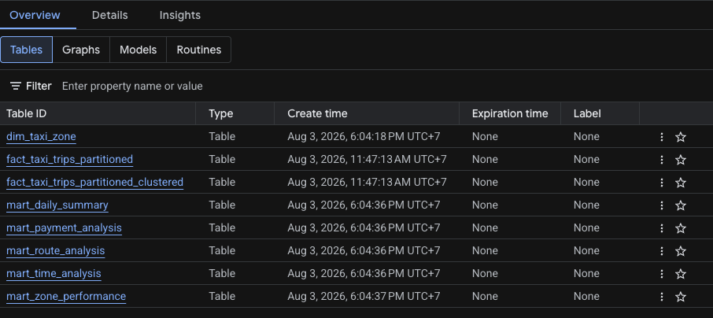
#### `streaming_tables`
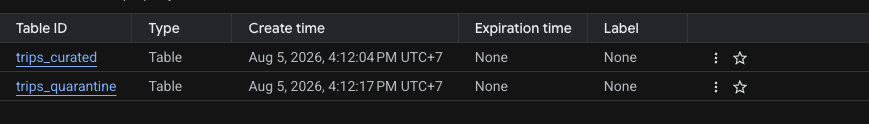

### Big Query Rows Output
---
#### `batch_fact_paritioned`
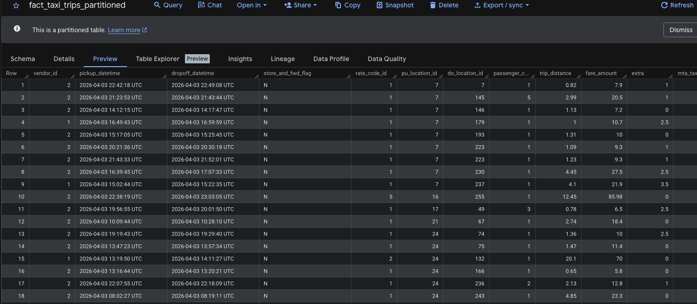

#### `streaming_data_curated`
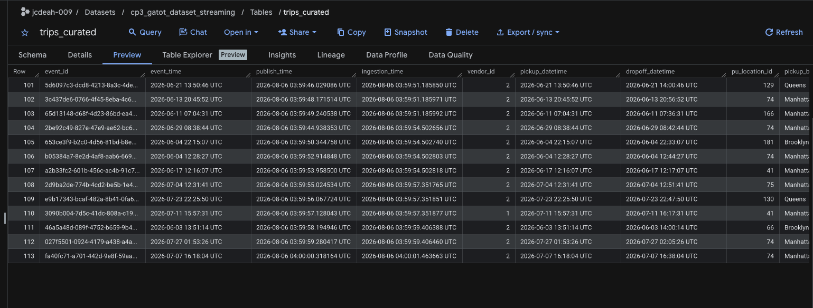


## Why partitioned tables

Why partitioning only, no clustering: partitioning already gives fast date-range scans, which covers how this data is actually queried. Dataset size here doesn't justify the extra complexity clustering adds — it's a bigger win on much larger tables with high-cardinality filtering beyond date. Adding it now would be over-engineering for the current scale; it's an easy add later if the data or query patterns grow.
 
**Partitioned vs. non-partitioned**
 
| | Non-partitioned | Partitioned |
|---|---|---|
| Query by date range | Scans entire table | Scans only matching partitions |
| Cost on large tables | High, grows with table size | Lower, scoped to date range |
| Best for | Small tables, no date filters | Large, time-series data (this project) |
 
 

**Partitioning vs. clustering**

 
| | Partitioning | Clustering |
|---|---|---|
| Granularity | Coarse (e.g. by day) | Fine (sorts rows within a partition) |
| Best for | Date/time range filters | High-cardinality filters, e.g. `zone_id`, `vendor_id` |
| Used here | Partitioned by trip date | Clustered by pickup zone within each day's partition |

## Data quality

Both pipelines validate data before it's considered trustworthy:

- **Batch:** schema checks, null validation, invalid-value checks, row-count validation
- **Streaming:** event schema validation, metadata validation, business-rule validation, with events split into curated vs. quarantine partitions

## Idempotency Strategy

### Batch

- Pipeline execution is parameterized using `trip_year` and `trip_month`.
- Existing partitions are overwritten before loading new data.
- Re-running the same DAG does not create duplicate records as long as already configurable by **dtb** models.
- Fact tables use **dbt incremental models**, so only new or updated records are processed on subsequent runs.

### Streaming

- Every event contains a unique `event_id`.
- Invalid events are written to the quarantine table instead of being discarded.
- Valid events are appended to the curated table.

## What You Can Analyze

Since both the batch and streaming pipelines write to the same BigQuery warehouse, the platform supports historical reporting and near real-time operational analytics.

### 1. Most Profitable Pickup Zones (Historical)

Identify the pickup zones that consistently generate the highest revenue. This helps support long-term business decisions such as fleet allocation, pricing strategies, and identifying high-value service areas.

**Example Query Result**

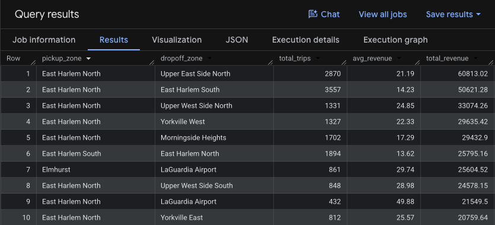

---

### 2. Top 10 Peak Hours (Historical vs. Streaming)

Compare the busiest operating hours in historical and streaming data to determine whether current demand follows historical patterns or shows unusual peaks that may require operational adjustments.

**Example Query Result**

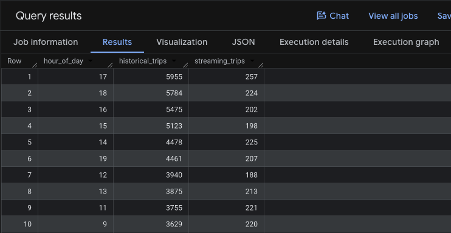
---

### 3. Top 10 Pickup Zones (Historical vs. Streaming)

Compare the busiest operating hours in historical and streaming data to determine whether current demand follows historical patterns or shows unusual peaks that may require operational adjustments.

**Example Query Result**

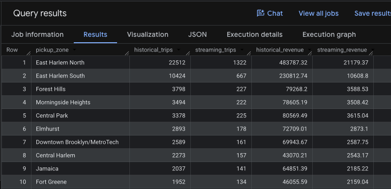

---

### 4. Payment Method Distribution (Historical vs Streaming)

Compare customer payment preferences between historical and streaming data to understand whether payment behavior is changing over time. Significant differences may indicate evolving customer preferences or potential payment system issues.

**Example Query Result**

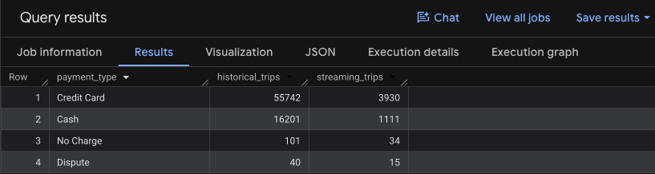

## Cost optimization

For local development, everything runs on the free/local tier where possible:

- Apache Beam runs locally via `DirectRunner`
- Airflow runs locally via Docker Compose
- BigQuery is used only as the analytical warehouse
- Pub/Sub is used only for streaming ingestion

To scale up, swap the Beam runner for **Google Cloud Dataflow** — no changes needed to the pipeline logic itself.

## Future Update

-  Deploy Beam on Dataflow
-  CI/CD with GitHub Actions
-  Terraform infrastructure